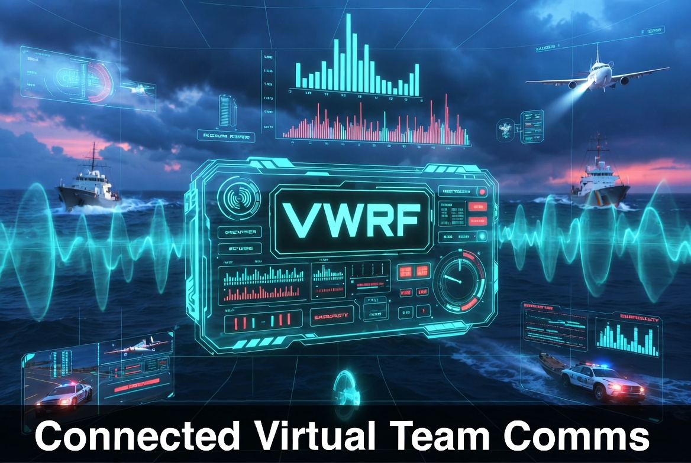
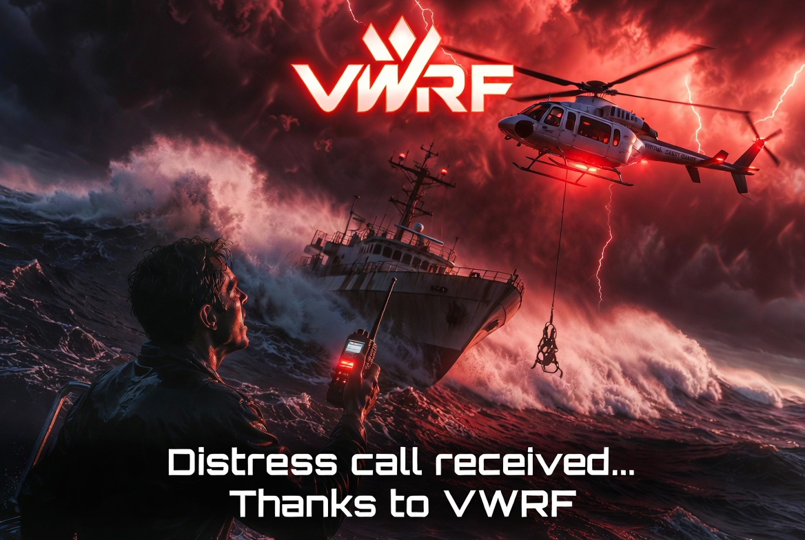
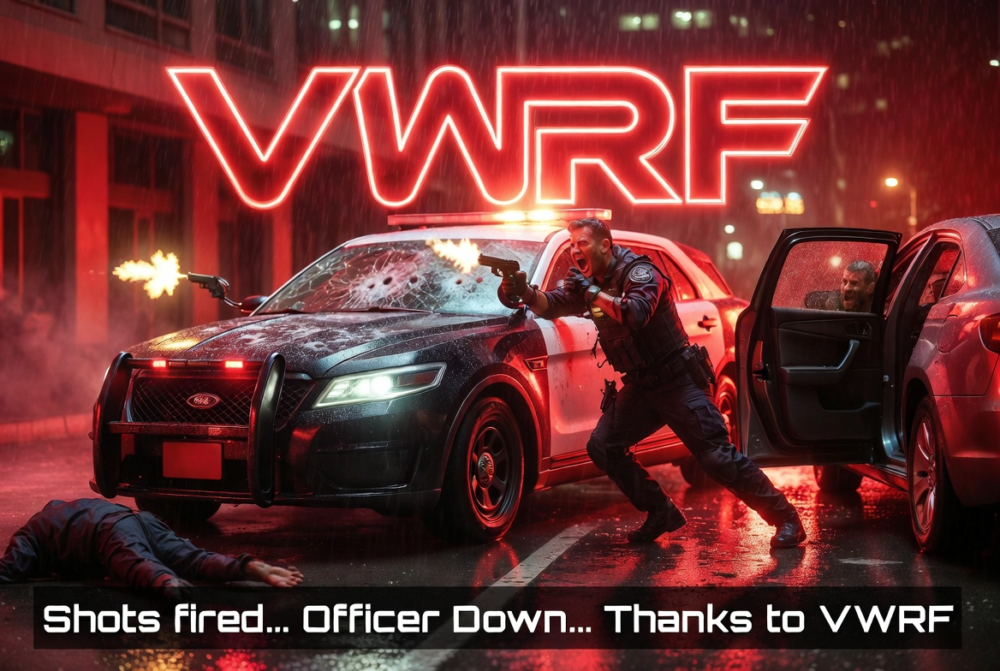
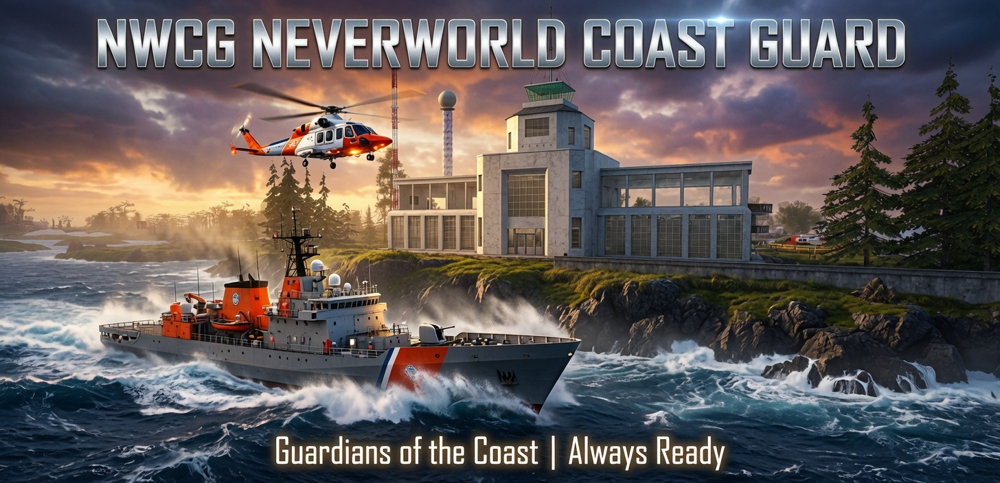
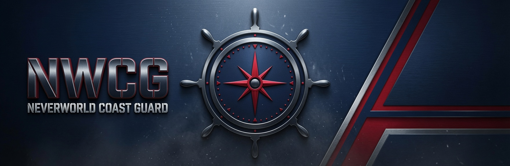

# 📡 VWRF — Virtual World Radio Frequency

<div align="center">



### *Grid-Wide. Loud and Clear.*

**An OpenSimulator Grid-Wide Software-Defined Radio Communications System**
*For Maritime, Aviation, Public Safety & Emergency Services Roleplay*

[](https://gridxchange.co)
[](https://opensimulator.org)
[](https://neverworldgrid.com)
[](https://gridxchange.co)

</div>

---

## What is VWRF?

VWRF is a **grid-wide software-defined radio system** for OpenSimulator virtual worlds. It provides real-time communications across all regions of a grid on dedicated named channels — just like a real-world radio network.

Whether you are a sailor calling the harbor master, a pilot requesting ATC clearance, a highway patrol officer coordinating a pursuit, or a Coast Guard dispatcher monitoring distress channels — VWRF keeps everyone connected, **grid-wide**.

> *"Your signal. Every shore. Every sky. Every frequency."*

---

## The Story

<div align="center">


*Distress call received... Thanks to VWRF*



*Shots fired... Officer Down...Help Arrives.... Thanks to VWRF*

</div>

VWRF was born from a simple idea: **roleplay communities deserve real infrastructure.** The maritime sailors of Neverworld Grid needed ship-to-shore communications. The Neverworld Coast Guard needed a distress monitoring system. The aviation community needed ATC. What started as a nautical communicator became a full grid-wide radio ecosystem.

**Launched July 4th, 2026 on Neverworld Grid.**

---

## Features

### 🎙️ Real-Time Grid-Wide Communications
- Messages relay instantly across all grid regions
- No region boundaries — communicate from any sim to any sim
- Persistent message logging with automatic 90-day purge

### 📻 Named Channel System
- Organized channel groups for different communities
- Channels can be open, restricted, or receive-only
- Channels added and removed dynamically — no server restarts

### 🆘 Distress Beacon System
- One-touch SOS activation from the wearable HUD
- Simultaneous broadcast to all Coast Guard channels
- Auto-pulses every 3 minutes with vessel name, captain, region, and GPS coordinates
- Wall-mounted Distress Monitor with flashing alert display

### 📼 Message History Replay
- Missed traffic while offline? One button replays the last 5 messages
- Per-channel history — catch up on what you missed

### 🖥️ Dispatch Control Panel
- In-world admin console for grid operators and organization commanders
- Broadcast to all channels simultaneously
- Create and delete channels on the fly
- View all active devices across the grid

### 📡 Scanner Device
- Receive-only desktop unit monitors multiple channels simultaneously
- Animated spectrum sweep display
- Perfect for dispatchers, harbor masters, and listeners

---

## Channel Groups

### ⚓ Nautical
| Channel | Description | Access |
|---------|-------------|--------|
| NAUT-GENERAL | Travelers General | Open |
| NAUT-S2S | Ship-to-Ship | Open |
| NAUT-S2SHORE | Ship-to-Shore | Open |
| NAUT-CGHAIL | Coast Guard — Hail | Open |
| NAUT-CGSAR | Coast Guard — SAR | Restricted |

### ✈️ Aircraft
| Channel | Description | Access |
|---------|-------------|--------|
| AIR-ATC | Air Traffic Control | Open |
| AIR-MAYDAY | Mayday Beacon | Open |
| AIR-CMD | Air Command | Restricted |

### 🚔 Public Safety
| Channel | Description | Access |
|---------|-------------|--------|
| PS-HIGHWAY | Highway Patrol | Restricted |
| PS-INCIDENT | Incident Management | Restricted |
| PS-HERO | HERO — Emergency Ops | Restricted |

### 📡 System
| Channel | Description | Access |
|---------|-------------|--------|
| SYS-HAIL | Universal Hail | Open |
| SYS-ADMIN | VWRF Admin Broadcast | Restricted |

*Additional channel groups planned: Fire & EMS, Park Ranger, Mountain Rescue*

---

## In-World Devices

### 🎙️ VWRF Marine Radio HUD
The primary wearable communicator. Attaches to the bottom-left of your viewer UI. Features an authentic amber LCD display showing your current channel, TX/RX indicators, vessel name management, one-touch SOS, and message history replay.

### 📡 VWRF Desktop Scanner
A receive-only monitoring device styled after professional desktop scanners. Monitors multiple channels simultaneously with an animated spectrum display. Perfect for dispatch rooms, harbor master offices, and operations centers.

### 🚨 NWCG Distress Monitor
A wall-mounted emergency display for Coast Guard and dispatch facilities. Monitors all distress channels and triggers a dramatic full-screen alert with flashing red frame when a MAYDAY is received.

### 🖥️ Dispatch Control Panel
An admin console for authorized personnel. Manage channels, broadcast grid-wide alerts, and monitor all active devices from a single interface.

---

## The NWCG — Neverworld Coast Guard

<div align="center">



*Guardians of the Coast | Always Ready*



</div>

VWRF is the communications backbone of the **Neverworld Coast Guard (NWCG)** — NWG's maritime search and rescue organization. The NWCG headquarters, modeled after the historic [1940 Air Terminal](https://en.wikipedia.org/wiki/1940_Air_Terminal_Museum) in Houston, Texas, houses a full operations center with Distress Monitor, Dispatch Panel, Scanner array, and marine radio consoles.

---

## Architecture
```

- **Backend:** Python/Flask, MariaDB, Nginx, Gunicorn
- **In-world:** LSL/OSSL scripts using `llHTTPRequest` and `osSetDynamicTextureDataFace`
- **No region relays required** — all communication routes through the central relay server
- **90-day rolling message log** with automatic purge via MariaDB event scheduler
- **Multi-tenant ready** — grid_id architecture supports multiple grids

---

## Roadmap

### v1.1 — History & Polish
- [ ] Message history replay fully tested
- [ ] Body-worn radio companion script
- [ ] Vehicle integration hooks (boats, aircraft, police vehicles)
- [ ] NWCG zone mapping and station network

### v2.0 — Emergency Infrastructure
- [ ] Rotating emergency beacon lighting system
- [ ] Searchlight/spotlight alert system
- [ ] Fire & EMS channels
- [ ] Park Ranger and Mountain Rescue channels
- [ ] NWCG multi-zone coverage map

### v3.0 — VWRF as a Service
- [ ] Multi-grid SaaS platform
- [ ] Grid operator portal at gridxchange.co
- [ ] API key authentication per grid
- [ ] Subscription tiers (see below)

---

## 🌐 VWRF as a Service — Coming Soon

VWRF will be available as a hosted service for other OpenSimulator grids.

| Tier | Price | Channels | Features |
|------|-------|----------|---------|
| **Community** | Free | 1 shared public channel | Cross-grid hailing frequency |
| **Crew** | $5/mo | 3 private channels | Perfect for small RP communities |
| **Fleet** | TBD | 10 private channels | Mid-size grids and organizations |
| **Armada** | TBD | Unlimited + custom branding | Large grids, full white-label |

**Interested in early access?** Contact us at gridxchange.co or reach out to **Gundahar Bravin** on Neverworld Grid.

> The free Community tier includes access to `VWRF-PUBLIC` — a universal cross-grid hailing frequency open to all participating grids.

---

## Live Demo

VWRF is live on **Neverworld Grid** — visit us and try it for yourself:

🌐 [neverworldgrid.com](https://neverworldgrid.com)

The NWCG Operations Center at the Coast Guard Station - Alpha is open to visitors. HUD devices are available at the Welcome Hub.

---

## About

**VWRF** was designed and built by **Gundahar Bravin**

- 🌐 Grid: [neverworldgrid.com](https://neverworldgrid.com)
- 📡 Service: [gridxchange.co](https://gridxchange.co)
- 💻 GitHub: [github.com/mteedev](https://github.com/mteedev)

---

<div align="center">

**VWRF — Virtual World Radio Frequency**

*Grid-Wide. Loud and Clear.* 📡

</div>
